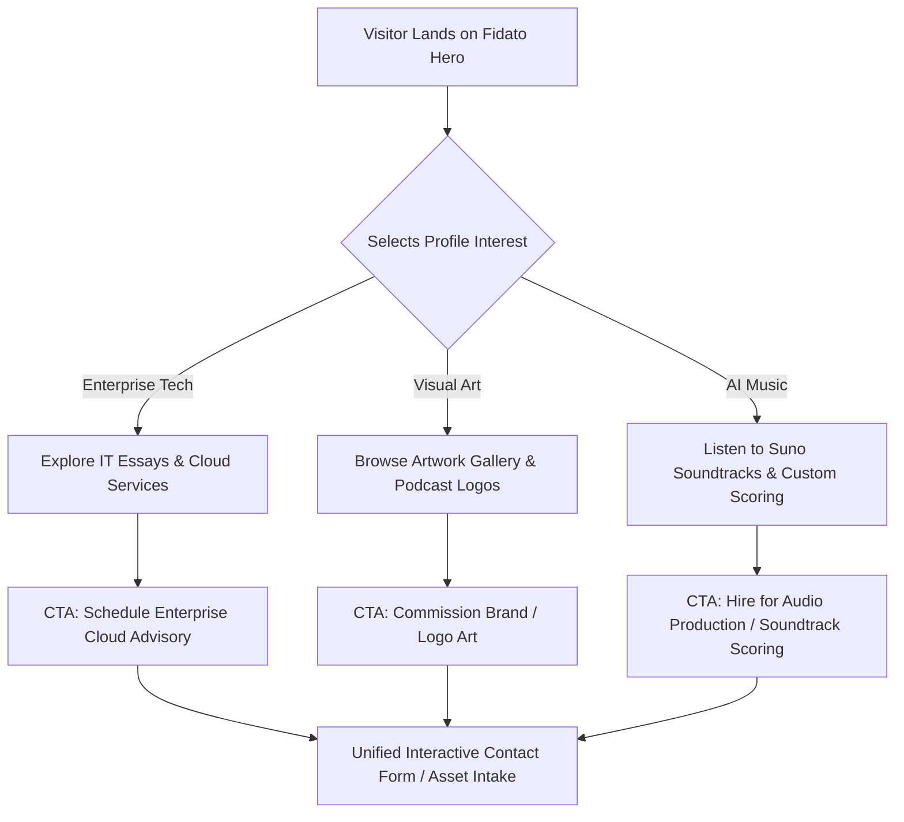

# Fidato Ecosystem: Portfolio Website Blueprint

**Brand Identity:** Fidato (Venkatesh R)  
**Positioning:** Unifying Systems Architecture, Visual Art, and AI Audio Innovation  
**Core Tagline:** *"Fidato: Enterprise Strategy Meets AI-Driven Creative Direction."*

---

## 1. Information Architecture & Navigation UX

### Top Navigation Bar (Header)
- **Brand Logo / Mark:** `FIDATO` [ Monogram Logo: Interolithic F mark ]
- **Pillar Links:**
  1. `[01] Enterprise Systems & AI` -> `#enterprise-architecture`
  2. `[02] Visual & Podcast Art` -> `#visual-art`
  3. `[03] AI Music & Audio Production` -> `#audio-production`
- **Global CTA Button:** `Book Creative & Tech Advisory` -> Triggers dynamic contact drawer/modal.

---

## 2. Hero Section Blueprint

### Visual Design & Aesthetics
- **Theme:** Minimalist Dark Cyber-Sculptural aesthetic (`#0A0D14` obsidian background, `#00F2FE` cyan glow for IT, `#9D4EDD` amethyst glow for Visual Art, `#FFB703` warm amber for Audio).
- **Hero Backdrop:** Subtle dynamic canvas particle system with 3 intersecting nodal orbits representing the 3 core domains.

### Web Copy Blueprint
```html
<section class="hero-section">
  <div class="badge">Ecosystem Identity // Venkatesh R</div>
  <h1 class="hero-title">
    Unifying Systems Architecture, <br>
    <span class="gradient-text-art">Visual Art</span>, and <span class="gradient-text-audio">AI Audio Innovation</span>.
  </h1>
  <p class="hero-tagline">
    "Fidato: Enterprise Strategy Meets AI-Driven Creative Direction."
  </p>
  <p class="hero-subtext">
    Architecting resilient multi-cloud infrastructures, orchestrating multi-genre AI soundtrack scoring, 
    and crafting iconic podcast brand identities for the next generation of digital media.
  </p>

  <div class="pillar-nav-cards">
    <!-- Pillar 1 -->
    <a href="#enterprise-architecture" class="pillar-card pillar-it">
      <div class="pillar-number">01</div>
      <h3>Enterprise Cloud & AI Strategy</h3>
      <p>19+ Years Cloud (GCP/AWS/Azure), IaC, Cloud Security & AI Governance</p>
      <span class="card-link">Explore Architecture Essays & Services &rarr;</span>
    </a>

    <!-- Pillar 2 -->
    <a href="#visual-art" class="pillar-card pillar-art">
      <div class="pillar-number">02</div>
      <h3>Visual Art & Brand Direction</h3>
      <p>Podcast Covers, Logo Design & YouTube Storytelling Identity</p>
      <span class="card-link">View Portfolio Gallery &rarr;</span>
    </a>

    <!-- Pillar 3 -->
    <a href="#audio-production" class="pillar-card pillar-music">
      <div class="pillar-number">03</div>
      <h3>AI Music & Sound Director</h3>
      <p>Suno AI Scoring, Prompt Engineering, Lyricism & Podcast Audio</p>
      <span class="card-link">Listen to Suno Discography &rarr;</span>
    </a>
  </div>
</section>
```

---

## 3. Detailed Section Blueprints (The 3 Core Profiles)

### Profile 1: IT Professional & AI Strategist Profile (`#enterprise-architecture`)


#### Copy & Content Architecture
- **Section Headline:** *19+ Years Engineering High-Availability Systems & Strategic AI Governance*
- **Subheadline:** *Translating complex enterprise infrastructure requirements into scalable, secure cloud platforms.*
- **Core Pillars Highlighted:**
  - **Multi-Cloud Architecture:** GCP, AWS, Azure enterprise landing zones, cloud migrations, and zero-trust security perimeter design.
  - **Infrastructure as Code (IaC):** Terraform, CloudFormation, Ansible automated infrastructure pipelines.
  - **AI Governance & System Integration:** Deploying enterprise LLM pipelines, AI guardrails, and compliance frameworks.
- **Thought Leadership & Essays (Medium Integration):**
  - Featured Article 1: *"Architecting Zero-Trust AI Workflows in Enterprise Multi-Cloud"* (Medium `@tatankavenkat_19803`)
  - Featured Article 2: *"The Strategic Convergence of Infrastructure as Code and Generative AI"* (Medium `@immortalassuran`)
- **Primary CTA:** `Request Enterprise Cloud Consultation`

---

### Profile 2: Artist & Visual Designer Profile (`#visual-art`)


#### Copy & Content Architecture
- **Section Headline:** *Visual Storytelling, Brand Identity & Digital Artistry*
- **Subheadline:** *Crafting distinctive brand symbols, podcast identities, and narrative digital art.*
- **Featured Case Studies & Work Showcase:**
  1. **"The Curious Leader" Podcast Brand Identity:**
     - *Concept:* Dual silhouette design blending forward-looking intellect with high-contrast minimalist geometry.
     - *Scope:* Spotify & Apple Podcast covers, social graphics, brand guidelines.
  2. **"Mishka Art by Fidato" Series Branding:**
     - *Concept:* Harmonious integration of a glowing feather quill, digital audio waveform, and candle flame.
     - *Scope:* Artwork suite, thumbnail templates, title sequence graphics.
  3. **YouTube Channel Visual Direction:**
     - `@unheardstoriesfrompoet`: Emotional visual poetry, thumbnail suites, narrative branding.
     - `@KuttiKadhaiUlagam`: Children's storytelling artwork, vibrant color systems, character illustration direction.
- **Portfolio Link Out:** Interactive gallery embedded from [Fidato's Art Portfolio](https://fidatosartportfolio.nxtdev.xyz/).
- **Primary CTA:** `Commission Custom Artwork / Brand Design`

---

### Profile 3: AI Music Director & Freelance Audio Producer (`#audio-production`)


#### Copy & Content Architecture
- **Section Headline:** *Pioneering AI Music Composition, Audio Scoring & Sound Architecture*
- **Subheadline:** *Merging prompt engineering, lyric writing, and genre synthesis into cinematic audio experiences.*
- **Suno Director Profile Highlights (@fidato_warrior):**
  - **Suno Platform Profile:** Direct integration with [suno.com/@fidato_warrior](https://suno.com/@fidato_warrior).
  - **Audio Specializations:** Multi-genre soundtrack scoring, ambient soundscapes, podcast intro/outro signatures, cinematic orchestral arrangements, and custom vocal synthesis.
  - **Prompt Engineering & Lyricism:** Structuring metered lyrics, style tags, acoustic dynamics, and multi-part movement transitions for Suno models.
- **Service Offerings:**
  1. **Podcast & Media Soundtrack Scoring:** Custom sonic branding and intro themes.
  2. **AI Music Production & Prompt Consulting:** Mentorship and prompt architecture for creators.
  3. **Full Audio-Visual Package:** Combined custom music track + podcast logo + YouTube banner.
- **Primary CTA:** `Commission Custom AI Soundtrack`

---

## 4. CTA Flows, Lead Generation & Conversion Funnel



---

## 5. Technical Stack & SEO Metadata

### Technical Recommendations
- **Framework:** HTML5 + Vanilla CSS Custom Properties + Modular JavaScript (or React / Vite single page application).
- **Typography:** 
  - Headings: `Outfit` or `Cabinet Grotesk`
  - Body: `Inter` or `Plus Jakarta Sans`
  - Code/Metrics: `JetBrains Mono`
- **Performance Targets:** 98+ Google Lighthouse performance score, zero cumulative layout shift.

### SEO Meta Tags Blueprint
```html
<title>Fidato (Venkatesh R) | Enterprise Cloud Architect, Visual Artist & AI Music Director</title>
<meta name="description" content="Official portfolio of Fidato (Venkatesh R). 19+ years Enterprise Cloud & AI Strategy, Visual Art & Podcast Logos ('The Curious Leader', 'Mishka Art'), and Suno AI Music Production (@fidato_warrior).">
<meta name="keywords" content="Fidato, Venkatesh R, AI Music Director, Suno AI Music, Enterprise Cloud Architecture, Podcast Branding, The Curious Leader, Mishka Art, Visual Artist">
<meta property="og:title" content="Fidato | Enterprise Strategy Meets AI-Driven Creative Direction">
<meta property="og:image" content="https://fidatosartportfolio.nxtdev.xyz/og-cover.jpg">
```
